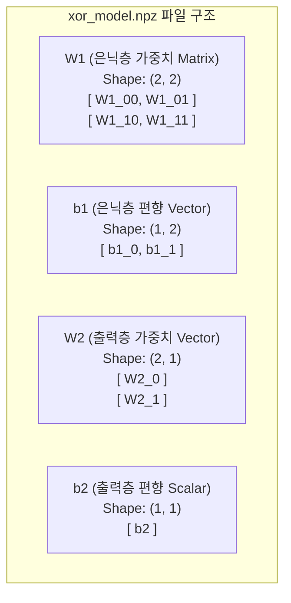
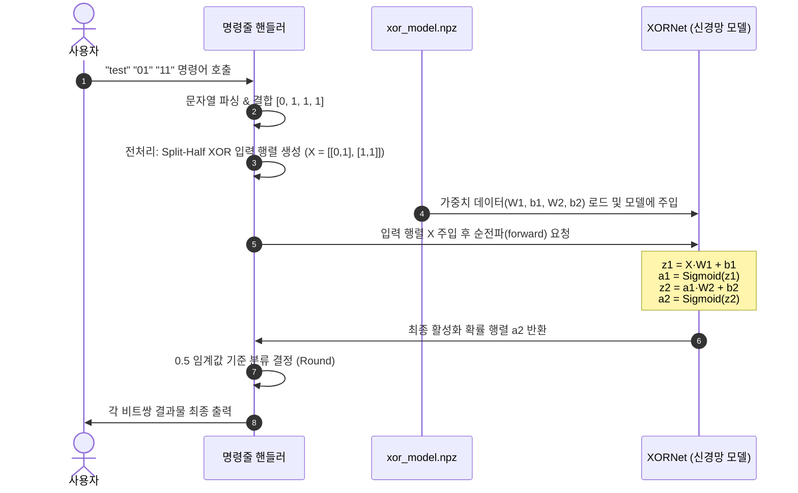
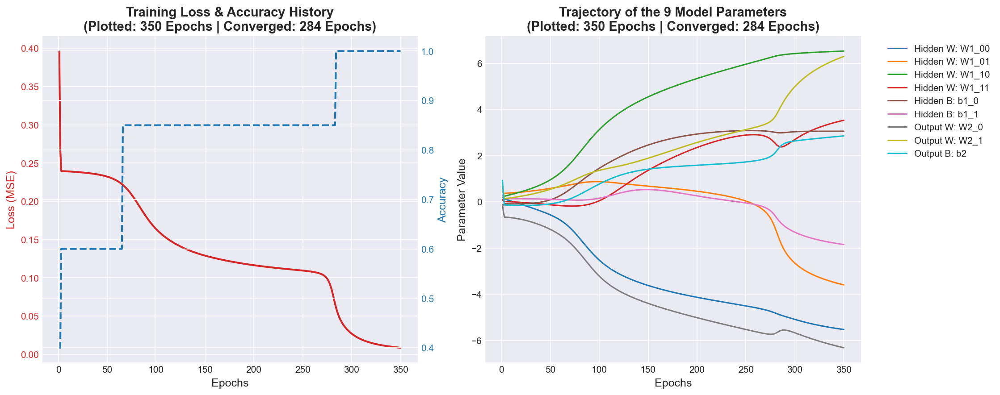

# 🧠 교육용 가이드: XOR 신경망의 내부 작동 원리

이 문서는 순수 NumPy 기반으로 구현된 **XOR 신경망 분류기**의 설계 구조, 학습 과정, 그리고 추론 방식에 대한 세부적인 교육용 설명 자료입니다. 실제 코드의 구체적인 흐름과 함께 딥러닝 입문자가 쉽게 이해할 수 있도록 다이어그램과 수식을 활용해 설명합니다.

---

## 1. 📥 입력 파라미터 (Input Parameters)

신경망이 정상적으로 작동하기 위해서는 입력받은 데이터를 수학적인 연산이 가능한 형태(행렬)로 변환해 주어야 합니다. 본 프로젝트에서는 학습(`learn`) 모드와 테스트(`test`) 모드에서 각각 다음과 같은 구체적인 형태로 데이터가 입력됩니다.

### A. 학습 모드 (`learn` 실행 시)
*   **학습용 입력 행렬 $X$**: 20개의 데이터 샘플을 가집니다. 각 샘플은 분할된 바이트 배열의 반쪽 쌍(2차원)을 이룹니다.
    *   **모양 (Shape)**: `(20, 2)` (2차원 NumPy 배열)
    *   **구체적인 데이터 예시**:
        ```python
        X = np.array([
            [0, 1],
            [1, 1],
            [0, 0],
            [1, 0],
            # ... 총 20개 행(샘플) 존재
        ])
        ```
*   **학습용 정답 레이블 $y$**: 입력 행렬 $X$의 각 행에 해당하는 참값(XOR 연산 결과)입니다.
    *   **모양 (Shape)**: `(20, 1)`
    *   **구체적인 데이터 예시**:
        ```python
        # X의 각 행에 대해 XOR을 적용한 결과 ([0, 1] -> 1, [1, 1] -> 0 등)
        y = np.array([
            [1],
            [0],
            [0],
            [1],
            # ... 총 20개 행 존재
        ])
        ```

### B. 테스트 모드 (`test` 실행 시 전처리 과정)
사용자가 터미널에서 입력한 두 인수를 결합한 뒤, 절반으로 분할(split-half)하고 다시 좌표 쌍으로 재배열하여 모델에 투입합니다.

> [!NOTE]
> **예시 명령어**: `python xor_ml_visualizer.py test "01" "11"`

1.  **입력 인수 파싱**:
    *   `arg1 = "01"` $\rightarrow$ `list1 = [0, 1]`
    *   `arg2 = "11"` $\rightarrow$ `list2 = [1, 1]`
2.  **데이터 결합 (Concatenate)**:
    *   `combined = list1 + list2` $\rightarrow$ `[0, 1, 1, 1]`
3.  **반으로 나누어 XOR 쌍 생성 (Split-Half & Zip)**:
    *   `first_half` (첫 반쪽): `[0, 1]`
    *   `second_half` (뒷 반쪽): `[1, 1]`
    *   **모델 투입용 최종 입력 행렬 $X$**:
        ```python
        X = np.array(list(zip(first_half, second_half)))
        # 결과값: np.array([[0, 1], [1, 1]])
        # 모양 (Shape): (2, 2)
        ```
        *   **첫 번째 비트 쌍**: `[0, 1]` (인덱스 0번 요소끼리 대응)
        *   **두 번째 비트 쌍**: `[1, 1]` (인덱스 1번 요소끼리 대응)

---

## 2. 🗂️ 모델 파일의 구조와 가중치 변경 메커니즘

학습된 인공신경망은 가중치(Weights)와 편향(Biases)이라고 불리는 숫자 형태의 **매개변수(Parameters)**들을 저장하는 파일입니다. 

### A. 모델 파일 (`xor_model.npz`)의 대략적인 구조
본 프로젝트는 NumPy의 압축 보관 파일(`.npz`) 구조를 활용해 신경망에 포함된 **9개의 실수 매개변수**를 보관합니다.



*   **은닉층 (Hidden Layer) 파라미터**:
    *   `W1` (가중치): 입력값 2개를 뉴런 2개로 보낼 때 통과하는 4개의 시냅스 강도.
    *   `b1` (편향): 은닉층 뉴런 2개 각각의 고유 활성화 임계점(Bias) 2개.
*   **출력층 (Output Layer) 파라미터**:
    *   `W2` (가중치): 은닉층에서 전달되는 2개의 신호가 최종 출력 뉴런으로 들어갈 때의 2개 가중치.
    *   `b2` (편향): 최종 출력 뉴런의 고유 임계점(Bias) 1개.

### B. 입력값에 따른 가중치 변경 (경사하강법 및 역전파)
모델 파일 내의 수치들은 고정되어 있지 않고, 학습 과정 동안 **입력값($X$)**과 **실제 정답($y$)**의 오차를 기반으로 계속 업데이트됩니다.

```mermaid
flowchain
    step1: 입력값 X 투입 (Forward)
    ==> step2: 예측치 계산 (W1, b1, W2, b2 활용)
    ==> step3: 오차 측정 (y - 예측치)
    ==> step4: 역전파 (Backward) 로 가중치 경사(Gradient) 계산
    ==> step5: 가중치 업데이트 (수정반영)
```

1.  **오차 측정**: 신경망이 내놓은 예측값과 실제 정답 $y$의 거리인 평균제곱오차(MSE)를 측정합니다.
2.  **경사(Gradient) 계산**: 역전파(`backward`) 알고리즘을 수행하여 각 매개변수가 오차에 얼마나 영향을 미쳤는지 미분을 통해 기울기(`dW1`, `db1`, `dW2`, `db2`)를 계산합니다.
3.  **값 조정**: 학습률(Learning Rate, $\eta = 0.5$)을 적용해 오차를 최소화하는 방향으로 매개변수를 조정합니다.
    $$W_1 \leftarrow W_1 + \eta \times dW_1$$
    $$b_1 \leftarrow b_1 + \eta \times db_1$$
    $$W_2 \leftarrow W_2 + \eta \times dW_2$$
    $$b_2 \leftarrow b_2 + \eta \times db_2$$
4.  **수렴**: 이 과정을 반복하면, 가중치 값들이 점진적으로 수렴하면서 수학적으로 **XOR 데이터 포인트들을 정확히 구분하는 초평면(Hyperplane)**을 만들게 됩니다.

---

## 3. 💾 모델 파일이 저장되는 시점

모델 파일(`xor_model.npz`)은 학습 세션이 완벽히 마무리되는 순간에 단 한 번 디스크에 물리적으로 생성 및 저장됩니다.

```text
[ python xor_ml_visualizer.py learn 실행 ]
       │
       ▼
 1단계: 데모용 분할-반쪽 바이트 연산 예시 출력
       │
       ▼
 2단계: 신경망 초기 매개변수 생성 (난수)
       │
       ▼
 3단계: 총 10,000회 에포크(Epoch) 동안 반복 학습 진행
       ├── (Forward -> Backward -> 가중치 미세 조정)
       └── 100% 정확도 도달 (약 284 Epoch 부근에서 조기 정밀 최적화 돌입)
       │
       ▼
 4단계: 최종 학습 결과 평가 및 350 Epoch 기준의 학습 궤적 PNG 차트 저장
       │
       ▼
 5단계: ★ save_model() 함수 실행 ★ 
       └── 메모리에 유지되던 최종 W1, b1, W2, b2 배열을 np.savez()를 이용해
           'xor_model.npz' 파일로 바이너리 압축 저장함 (이 시점에 파일 생성)
```

*   **저장 코드가 동작하는 물리적 시점**: `xor_ml_visualizer.py` 내의 `save_model(model)`이 호출되어 `np.savez(filename, W1=model.W1, b1=model.b1, W2=model.W2, b2=model.b2)` 명령이 정상적으로 완료되는 순간입니다.

---

## 4. 🔍 테스트(추론) 시 결과 도출 과정

학습된 모델 파일을 활용해 새로운 입력값에 대한 예측 결과를 계산해 내는 세부 파이프라인은 다음과 같이 설계되어 있습니다.

> [!IMPORTANT]
> **시나리오**: `python xor_ml_visualizer.py test "01" "11"` 명령어 실행 시



### 상세 단계별 내부 수식 연산 과정
입력 $X = \begin{bmatrix} 0 & 1 \\ 1 & 1 \end{bmatrix}$ (두 개의 쌍)에 대한 출력 도출:

1.  **은닉층 선형 계산 및 활성화**:
    $$z_1 = X \cdot W_1 + b_1$$
    *   입력 $X$와 가중치 $W_1$을 행렬 곱한 뒤 편향 $b_1$을 더해 $z_1$ 신호 벡터를 만듭니다.
    $$a_1 = \text{Sigmoid}(z_1) = \frac{1}{1 + e^{-z_1}}$$
    *   비선형 활성화 함수인 시그모이드를 거쳐 0과 1 사이의 뉴런 활성화 값 $a_1$을 만듭니다.
2.  **출력층 계산 및 활성화**:
    $$z_2 = a_1 \cdot W_2 + b_2$$
    *   은닉층에서 올라온 신호 $a_1$에 출력 가중치 $W_2$를 곱하고 편향 $b_2$를 더합니다.
    $$a_2 = \text{Sigmoid}(z_2) = \frac{1}{1 + e^{-z_2}}$$
    *   최종 출력값인 확률 값 $a_2$ (예: `[[0.9919], [0.0057]]`)를 생성합니다.
3.  **반올림을 통한 최종 판정**:
    *   임계치인 `0.5`를 기준으로 삼아 반올림(Round) 처리를 수행합니다.
        *   첫 번째 샘플 `[0, 1]`의 출력 `0.9919` $\ge 0.5 \rightarrow$ **최종 분류 결과 `1` (참)**
        *   두 번째 샘플 `[1, 1]`의 출력 `0.0057` $< 0.5 \rightarrow$ **최종 분류 결과 `0` (거짓)**
    *   이진 분류 값으로 환산된 예측값을 사용자 터미널에 사람이 읽기 쉬운 형태로 정밀 매핑하여 출력합니다.

---

## 5. 📊 학습 시 시각화 및 매개변수 궤적(Trajectory) 분석

학습 시 수행된 최적화 상태와 9개 매개변수의 동적인 변화량은 아래 그래프를 통해 한눈에 파악할 수 있습니다.



### A. 왼쪽 그래프: 학습 손실(Loss) 및 정확도(Accuracy)의 흐름
*   **손실 곡선 (빨간색 실선 - Loss)**: 
    *   초기에는 큰 무작위 오차(약 0.25 내외의 MSE)로 시작합니다.
    *   역전파 알고리즘을 통한 지속적인 가중치 갱신 결과, 약 **250 에포크** 부근에서 손실 값이 급격하게 감소하여 거의 **0**에 근접하게 수렴하는 것을 볼 수 있습니다.
*   **정확도 곡선 (파란색 점선 - Accuracy)**: 
    *   초기 약 50%의 무작위 예측 성공률에서 시작하여, 신경망 매개변수가 비선형 XOR 경계를 파악해 감에 따라 계단식 형태로 정확도가 상승합니다.
    *   약 **284 에포크** 부근에서 최종적으로 **100% (1.0)** 정확도에 도달하여 수렴에 완벽하게 성공합니다.

### B. 오른쪽 그래프: 9개 매개변수(Parameter)의 궤적(Trajectory) 분석
이 그래프는 은닉층 가중치 4개, 은닉층 편향 2개, 출력층 가중치 2개, 출력층 편향 1개 등 총 **9개의 인자들**이 학습이 거듭됨에 따라 어떻게 값을 변화해 나가는지를 상세히 보여줍니다.

*   **은닉층 매개변수 ($W_1, b_1$)의 급격한 다변화**:
    *   XOR 패턴은 단일 선형 구분선으로 나눌 수 없으므로, 은닉층 뉴런 두 개는 각기 다른 비선형 영역의 경계를 맡아 학습해야 합니다.
    *   이에 따라 초기 $[-1, 1]$ 범위의 난수로 고르게 퍼져 있던 은닉층 가중치(`W1_00`, `W1_01`, `W1_10`, `W1_11`)와 은닉층 편향(`b1_0`, `b1_1`)이 학습 시작 직후 **극적인 파동과 경사 조정**을 거쳐 서로 다른 스펙트럼의 값으로 수렴해 갑니다.
*   **출력층 매개변수 ($W_2, b_2$)의 최종 분류 조정**:
    *   은닉층에서 올라온 고차원 비선형 결과값을 최종 정답 $y$에 매핑하기 위해, 출력 가중치와 출력 편향 역시 초반에 격렬한 궤적의 변화를 보이며 정답 레이블에 알맞게 정비례 또는 반비례하는 실수 값으로 조율됩니다.
*   **수렴 안정기 (284 에포크 이후)**:
    *   손실이 0이 되고 100% 정확도에 안착하는 약 **284 에포크 이후**부터는 9개 매개변수 그래프가 모두 **완벽한 평행선(수평 직선)**을 그리게 됩니다. 이는 신경망이 더 이상 불필요한 과적합을 일으키지 않고 가장 이상적인 최적의 가중치 상태를 안전하게 고정하고 있음을 직접적으로 입증합니다.
